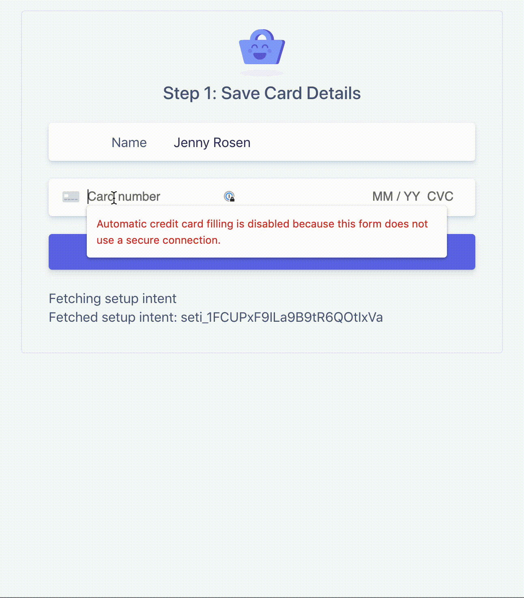

# Office Hours 2019-08-28

Walk through the basics of building a simple SCA compliant payment flow for
saving cards and charging them later with the Stripe API and PHP following [this guide](https://stripe.com/docs/payments/cards/saving-cards-without-payment).
> [🎬 Watch on
> YouTube](https://www.youtube.com/watch?v=95qSebQrm5E&list=PLy1nL-pvL2M6IYfRCmhOPcyC70zJqFoCs&index=3&t=0s)

# Getting Started

Follow these instructions to spin-up a copy of this demo project up on your
local machine for development and testing purposes. This is meant to be a guide
to show you how to go about building an SCA ready payment flow for saving and
charging cards later when the customer is off session. Additionally, there's an
example of how to bring a customer back "on session" to complete authentication,
if for some reason the off session payment failed for authentication required.

### Prerequisites
* PHP
* [Composer](https://getcomposer.org/doc/00-intro.md#installation-linux-unix-macos)
* [Stripe CLI](https://github.com/stripe/stripe-cli/)
* [Create a stripe account](https://dashboard.stripe.com/register)
* [Stripe API Keys](https://stripe.com/docs/keys)

## Step by step

1. **Configure your keys**

Copy the example `.env` file and update those values with your Stripe API keys.

```
cp .env.example .env
```

Then, be sure to update the publishable key (pk_xxx) in client/index.html.

2. **Start the server**

```sh
cd server/php
composer install
composer start
```

3. **Run the demo**

Try using the test card `4000002760003184` which requires authentication for
every transaction, will demonstrate the entire flow. Also, experiment with other
cards like `4242424242424242` (no authentication required) and 4000002500003155
(authentication required to setup). For more test cards see [https://stripe.com/docs/testing#cards](https://stripe.com/docs/testing#cards).

*Step 1: Saving card details*

Browse as the customer to [http://localhost:4242](http://localhost:4242) and
enter 4000002760003184 as the card number.

*Step 2: Admin interface for charging later*

Using the customer ID (cus_xxx) and payment method ID (pm_xxx) logged in Step 1,
charge the customer from this admin interface:
[http://localhost:4242/admin](http://localhost:4242/admin)


*Step 3: Complete authentication*

If off session payment fails because the transaction requires authentication,
you'll want to bring the customer back on session to complete payment. Use the
link from step 2 to view the "bring customer on session" page here:
[http://localhost:4242/complete?pi=pi_xxx&pm=pm_xxx](http://localhost:4242/complete)

### More Resources
* [SCA Overview](https://stripe.com/docs/strong-customer-authentication)
* [Stripe Developers YouTube Channel](https://www.youtube.com/channel/UCd1HAa7hlN5SCQjgCcGnsxw)
* [Stripe YouTube Channel](https://www.youtube.com/channel/UCM1guA1E-RHLO2OyfQPOkEQ)

### Demo Saving and Charging Later



### Demo Saving, Charging Later, and Bringing Customer On Session


