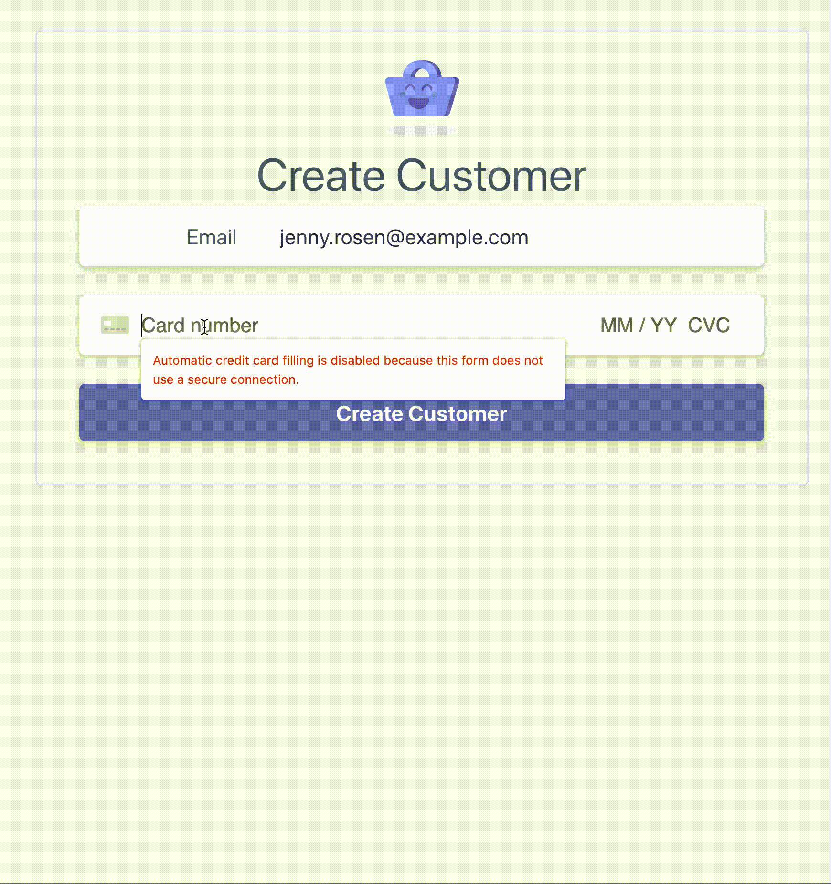

# Billing and Subscriptions (SCA) - Office Hours 2019-10-02

Walk through the basics of building an SCA compliant recurring billing flow with
the Stripe API and PHP.

> [🎬 Watch on YouTube](https://www.youtube.com/watch?v=GOp-Pt82Bes)

# Getting Started

Follow these instructions to spin-up a copy of this demo project up on your
local machine for development and testing purposes. This is meant to be a guide
to show you how to go about building an SCA ready billing flow for trial or
no-trial Subscriptions.

### Prerequisites
* PHP
* [Composer](https://getcomposer.org/doc/00-intro.md#installation-linux-unix-macos)
* [Stripe CLI](https://github.com/stripe/stripe-cli/)
* [A Stripe account](https://dashboard.stripe.com/register)
* [Stripe API Keys](https://stripe.com/docs/keys)

## Step by step

1. **Configure your keys**

Copy the example `.env` file and update those values with your Stripe API keys.

```
cp .env.example .env
```

Then, be sure to update the publishable key (pk_xxx) in client/index.html and
client/pricing.html

2. **Start the server**

```sh
cd server/php
composer install
composer start
```

3. **Run the demo**

Try using the test card `4000002760003184` which requires authentication for
every transaction, will demonstrate the entire flow. Also, experiment with other
cards like `4242424242424242` (no authentication required) and 4000002500003155
(authentication required to setup). For more test cards see [https://stripe.com/docs/testing#cards](https://stripe.com/docs/testing#cards).

*Step 1: Saving card details*

Browse to [http://localhost:4242](http://localhost:4242) and enter
4000002500003155 as the card number and an email address.

*Step 2: Select a Plan and Authenticate (SCA)*

After creating the customer, note the customer ID in the URL params. This is the
customer that will be subscribed to the new plan. Select a plan and complete
authentication.

### More Resources
* [SCA Overview](https://stripe.com/docs/strong-customer-authentication)
* [Stripe Developers YouTube Channel](https://www.youtube.com/channel/UCd1HAa7hlN5SCQjgCcGnsxw)
* [Stripe YouTube Channel](https://www.youtube.com/channel/UCM1guA1E-RHLO2OyfQPOkEQ)

### Demo


