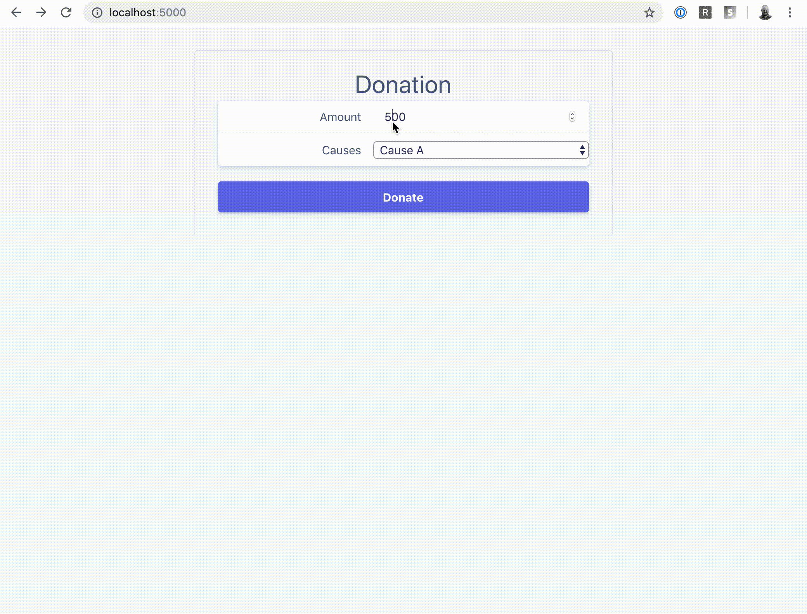

# Donations with Checkout 2020-01-28

Learn how to collect variable amount payments (donations) and use metadata with [Checkout](https://stripe.com/docs/payments/checkout).

> [🎬 Watch on YouTube](https://www.youtube.com/watch?v=X2SmLzQ5kfY)

# Getting Started

Follow these instructions to spin-up a copy of this demo project up on your
local machine for development and testing purposes. This is meant to be a guide
to show you how to go about building a simple page to collect variable amount
payments (donations). If your customers do not control the payment amount, please see our
[other episode about Checkout](../2019-11-21-checkout).

### Prerequisites
* Python
* [Flask](https://flask.palletsprojects.com/en/1.1.x/installation/)
* [Create a Stripe account](https://dashboard.stripe.com/register)
* [Stripe API Keys](https://stripe.com/docs/keys)

## Step by step

1. **Configure your keys**

Copy the example `.env` file and update those values with your Stripe API keys.

```
cp ../.env.example .env
```

Then, be sure to update the publishable key (pk_xxx) in templates/index.html.


2. **Install Dependencies**

```
python3 -m venv venv
. venv/bin/activate
pip install python-dotenv
pip install Flask
pip install stripe
```


3. **Start the server**

```
export FLASK_APP=server.py && flask run
```

### More Resources
* [SCA Overview](https://stripe.com/docs/strong-customer-authentication)
* [Stripe Developers YouTube Channel](https://www.youtube.com/channel/UCd1HAa7hlN5SCQjgCcGnsxw)
* [Stripe YouTube Channel](https://www.youtube.com/channel/UCM1guA1E-RHLO2OyfQPOkEQ)

### Demo


