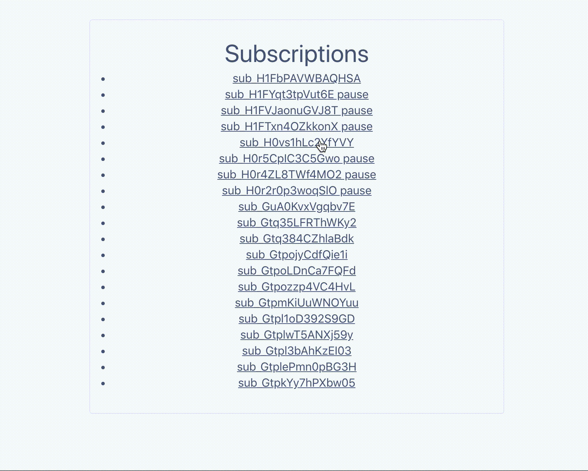

# Pausing Subscriptions - Office Hours 2020-04-03

Walk through the basics of [Subscription
pausing](https://stripe.com/docs/billing/subscriptions/pausing) using Ruby and
[Sinatra](http://sinatrarb.com/intro.html).

> [🎬 Watch on YouTube](https://youtu.be/177SsXpvy3I)

# Getting Started

Follow these instructions to spin-up a copy of this demo project up on your
local machine for development and testing purposes. This is meant to be a guide
to show you how to go about pausing Subscriptions.

### Prerequisites
* Ruby
* [Stripe CLI](https://github.com/stripe/stripe-cli/)
* [A Stripe account](https://dashboard.stripe.com/register)
* [Stripe API Keys](https://stripe.com/docs/keys)

## Step by step

1. **Configure your keys**

Copy the example `.env` file and update those values with your Stripe keys.

```
cp .env.example server/.env
```

Then, be sure to update the publishable key (pk_xxx) in client/manual.html.

2. **Start the server**

```sh
ruby server.rb
```

3. **Run the demo**

Create a customer with Stripe CLI:

```sh
stripe customers create \
  --description="Pausing Test Customer" \
  -d payment_method=pm_card_visa \
  -d invoice_settings[default_payment_method]=pm_card_visa
```

Create a subscription with Stripe CLI with the billing_cycle_anchor set to a few min from now:

```sh
stripe subscriptions create \
  --customer={ID_FROM_PREV} \
  -d "items[0][plan]"=plan_xxx \
  -d billing_cycle_anchor={UNIX_TIMESTAMP_60_SECONDS_FROM_NOW}
```

Pause a Subscription and review in your Stripe dashboard.


### More Resources
* [COVID-19 Stripe Resources](https://stripe.com/covid-19)
* [Stripe Developers YouTube Channel](https://www.youtube.com/channel/UCd1HAa7hlN5SCQjgCcGnsxw)
* [Stripe YouTube Channel](https://www.youtube.com/channel/UCM1guA1E-RHLO2OyfQPOkEQ)

### Demo


