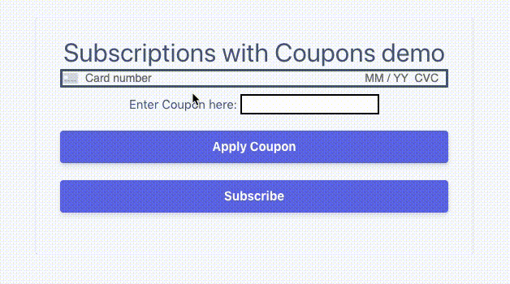

# Applying Coupons to Subscriptions - Office Hours 2020-04-10

Walk through the basics of [applying coupons to Subscriptions](https://stripe.com/docs/billing/subscriptions/discounts) using Ruby and [Sinatra](http://sinatrarb.com/intro.html)

> [🎬 Watch on YouTube](https://youtu.be/NA19ikfx2qQ)

## Requirements
* Ruby v2.4.5+
* [Stripe CLI](https://github.com/stripe/stripe-cli/)
* [Create a stripe account](https://dashboard.stripe.com/register)
* [Stripe API Keys](https://stripe.com/docs/keys)

## How to run

1. **Install dependencies in the `/server/` folder**
```
bundle install --path vendor/bundle
```

2. **Configure your keys**

Update the example `.env` file with your Stripe API keys.

3. **Create a recurring Plan and a Coupon (in test mode)**

- [Create a Plan](https://dashboard.stripe.com/test/products/create)

- [Create a Coupon](https://dashboard.stripe.com/test/coupons)

Enter the Plan ID and Coupon name and ID in `server.rb` file
```
plan_id = "plan_123"

COUPON_MAP = {
  name_of_coupon: "id_of_coupon",
}
```


3. **Run the application**
```
ruby server.rb
```

3. Go to `localhost:4242` in your browser to see the demo


### Demo




### More Resources
* [COVID-19 Stripe Resources](https://stripe.com/covid-19)
* [Stripe Developers YouTube Channel](https://www.youtube.com/channel/UCd1HAa7hlN5SCQjgCcGnsxw)
* [Stripe YouTube Channel](https://www.youtube.com/channel/UCM1guA1E-RHLO2OyfQPOkEQ)