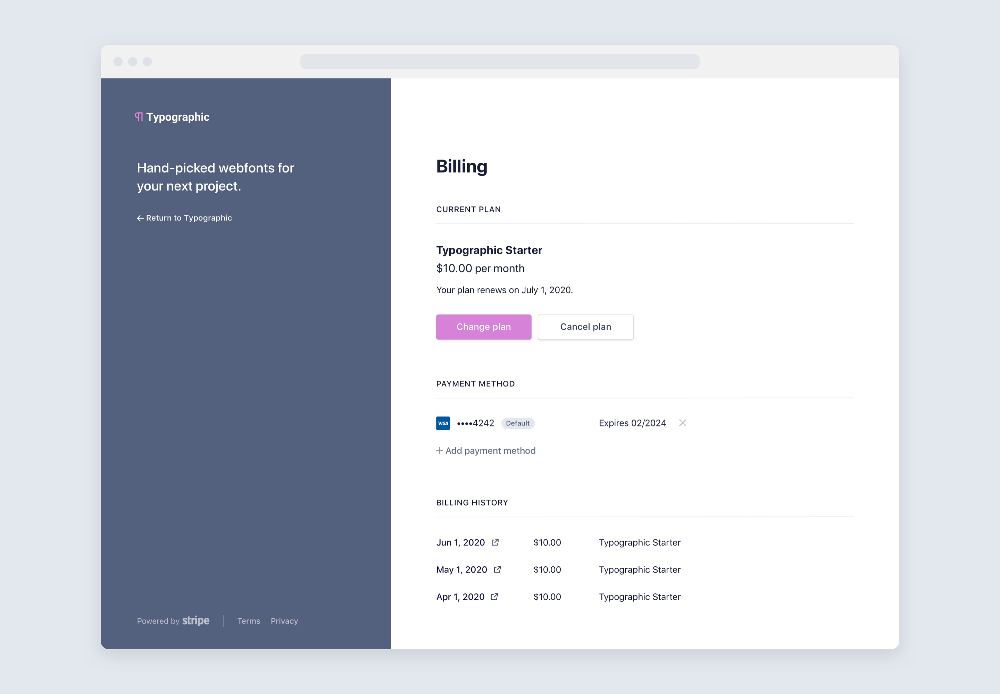
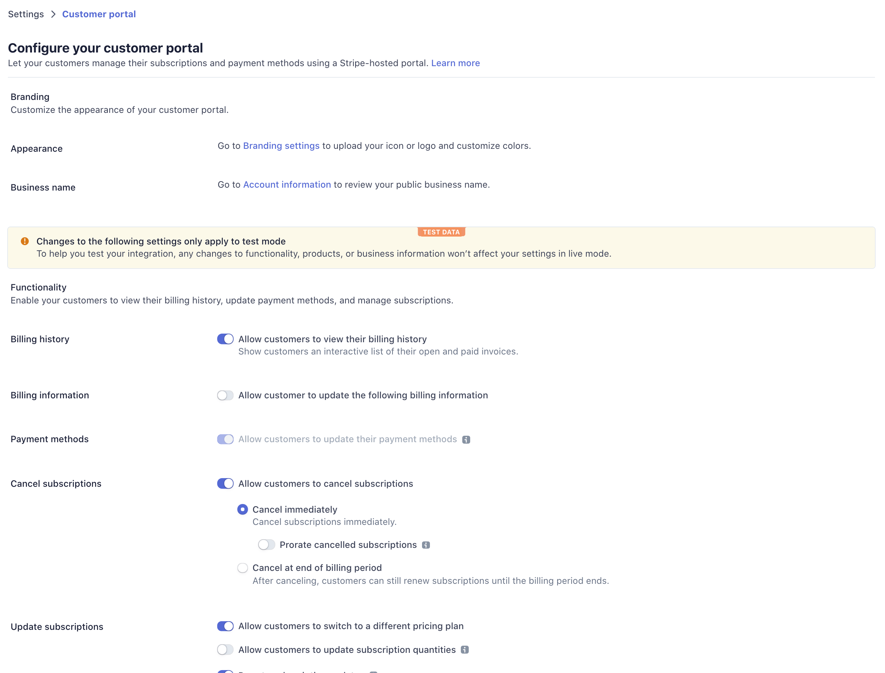

# Stripe Customer Portal

The [Customer
Portal](https://stripe.com/docs/billing/subscriptions/integrating-customer-portal)
is a Stripe hosted page where your customers can manage their billing. It can
be challenging to build all of the functionality for managing billing -- we
created the customer portal, so you don't have to. The following guide covers our
office hours session on June 29, 2020.

> [🎬 Watch on YouTube](https://www.youtube.com/watch?v=u8H6awDJVpM)

**Presenters:**

- [**Theodora Chu**](https://twitter.com/chu_onthis) - Product Manager @ Stripe
- [**CJ Avilla**](https://twitter.com/cjav_dev) - Developer Advocate @ Stripe


### Developer introduction [🎬](https://www.youtube.com/watch?v=u8H6awDJVpM&t=5s)


**Prerequisites:**

- [Create a stripe account](https://dashboard.stripe.com/register)
- [Stripe API Keys](https://stripe.com/docs/keys)
- [Ruby](https://www.ruby-lang.org/en/documentation/installation/)
- [Stripe CLI](https://github.com/stripe/stripe-cli/)

Everyone who has built a saas application can tell you there are many moving
parts:

- keeping track of your subscribers and their subscriptions
- an interface to upgrade or downgrade between service offerings
- a way to cancel
- some method that allows customers to update their payment method
- provisioning and de-provisioning mechanism

All of this is complicated further when dealing with [secure customer
authentication 🎬](https://www.youtube.com/watch?v=2kc-FjU2-mY), which is why
we’re ecstatic share the new customer portal, which abstracts away a lot of this
pain.

### Product overview [🎬](https://youtu.be/u8H6awDJVpM?t=101)

You can cut down your integration time and the time to launch your product with
the customer portal.

There is a UI where customers can manage their billing. Customers can change
their plan, cancel their plan, change their payment method, or see their
billing history. It's no secret these are components you have to build for your
product, but that they don't necessarily differentiate your product from
another. Today, you'll see how Stripe can manage this for you, so you don't
have to build it yourself.



In test mode in your Stripe dashboard, you can head over to your settings; under
**Billing** > [**Customer
Portal**](https://dashboard.stripe.com/test/settings/billing/portal), you can
configure and customize your portal. You can set up your brand settings and
business name; choose to enable certain functionality in the portal,
such as allowing the customer to view their billing history. Payment method
updates are permitted automatically as long as subscription updates are allowed.



You can add which products customers can switch too if you enable subscription
updates.

When a user makes that switch, you can choose to prorate that change and make
that change take place immediately or at the end of your billing period. Same
with cancellations, you can prorate and make that take effect immediately or at
the end of the billing period.

You can customize business information like headlines and links. You can
then see a preview of what comes out of the box. You don't have to manage any
of this yourself.


### Product and Price modeling [🎬](https://youtu.be/u8H6awDJVpM?t=233)

You can now model your business and product offerings in one place.

Products define what you sell; prices track how much and how often to charge. A
product can be for recurring or one time purchases, and it supports various
business structures from tiers to usage-based billing. Products and prices are
both core entities within Stripe, which work with subscriptions, invoices, and
Checkout.

Products are at the highest level. Products are what you sell. You'll need to
create at least one before you can charge for it. When you're building a saas
application with the _good_, _better_, _best_ model, you would have at least
three products. A product for the "good," a product for the "better," and a
product for the "best."

Each of the levels represents a different set of features or different levels
of feature value.

In the past, you may have created one single product at the top level with
multiple plans under that one product for each of the product levels.

However, to take advantage of the customer portal we need to make sure we get
the modeling correct from the get-go. If you have a setup fee for one of
your plans at one of these levels, you'll want to create that as a separate
product.

The API call is pretty simple to [create a
product](https://stripe.com/docs/api/products/create). We create the product by
passing in a name and any optional arguments like description images or a URL.

```rb
Stripe::Product.create(name: 'starter')
```

Prices define how much and how often to charge for products, including the
product cost, which currency to use, and if the price is recurring, the billing
interval. When we [create a price](https://stripe.com/docs/api/prices/create),
we assign it to the product and specify the unit amount, currency, and optional
interval.

```rb
Stripe::Price.create(
  product: 'prod_xxx',
  unit_amount: 500,
  currency: 'usd',
  recurring: {
    interval: 'month'
  },
  lookup_key: 'starter',
)
```

If you hard code the prices on your pricing page and decide to change the
service's cost later, typically, the process is manual, and you'd need to
deploy new code.  Instead of managing price changes with a deploy, you can use
this awesome new feature called
[`lookup_key`](https://stripe.com/docs/api/prices/create#create_price-lookup_key).
The key allows you to refer to the key in your pricing page and [swap out the
price later with
`transfer_lookup_key`](https://stripe.com/docs/billing/prices-guide#managing-prices)
without changing the hardcoded prices.

You can render different prices in the front end, then use the rendered price to bill
the customers.

In the response, we'll see the ID of the price which we can use to reference it later.

We can also list prices by their `lookup_key` to get back a list of prices
given an array of `lookup_keys`.

```rb
Stripe::Price.list(lookup_keys: ['starter'])
```

Now that we've modeled our business and we can create products and prices.
Let's get into the core of the demo: redirecting to the customer portal.


### Redirect to the portal [🎬](https://www.youtube.com/watch?v=u8H6awDJVpM&t=423s)

[Guide to integrating the customer portal](https://stripe.com/docs/billing/subscriptions/integrating-customer-portal)

Customers are redirected to a unique short-lived link that is unique to each customer
and unique to each "session." In order to create one of these links, you'll make
an API call to Stripe to [create a BillingPortal Session](https://stripe.com/docs/api/customer_portal/create).

Note that the `Session` created here is *not* the same as a Checkout Session.
When working with the client libraries in some languages like stripe-java,
you'll need to fully qualify the class name `Session` to avoid naming and import
conflicts.

It's important that when you share the URL of a BillingPortal session with a
customer, that you're certain the customer is authenticated. If you are passing
the ID of the customer from the front end, the user could modify that request to
be another user's Stripe customer ID and gain access to their account.

We want to add a button to our UI. When that button is clicked we'll send a
POST request to the backend to create a billing portal session and redirect to
the URL of the session.

Today's demo application is a private podcasting interface. In the demo,
we start from the list of private podcast episodes and show the authenticated user.

We want to add a button to the episodes index, which will redirect to the
billing portal.

Concerning the database: we store the email address, hashed password, the plan
for the customer which is the `lookup_key` for our Price. The Stripe Customer
ID and the Subscription status in the database. The Subscription status allows
us to provision access and control whether the user has access or not.

```rb
# db/schema.rb
  create_table "users", force: :cascade do |t|
    t.string "email"
    t.string "password_digest"
    t.string "plan" # lookup_key
    t.string "stripe_customer_id"
    t.string "session_token"
    t.datetime "created_at", precision: 6, null: false
    t.datetime "updated_at", precision: 6, null: false
    t.string "subscription_status", default: "incomplete"
    t.index ["email"], name: "index_users_on_email", unique: true
    t.index ["stripe_customer_id"], name: "index_users_on_stripe_customer_id", unique: true
  end
```

From the `dashboard.html.erb` layout, we want to add our button that will
redirect to the customer portal.

```html
<form action="/customer_portal_sessions" method="POST">
  <input type="hidden" name="authenticity_token" value="<%= form_authenticity_token %>">
  <button>Manage Billing</button>
</form>
```

Next we need to create a route that will create a Customer Portal. This is done in a new controller.

```sh
rails generate controller CustomerPortalSessions
```

This will be the controller that contains our redirect.

We need to pull the customer ID out of the database. It might be stored in
Firebase or some external database, but we want to pass the Stripe customer ID
for the authenticated customer. In Rails, we access the authenticated user
through `current_user`. `current_user` here is an instance of a `User` model.


```rb
def create
  portal_session = Stripe::BillingPortal::Session.create(
    customer: current_user.stripe_customer_id,
    return_url: 'http://localhost:3000/episodes'
  )
  redirect_to portal_session.url
end
```

The portal session has a property called the `url`, and that is where we want
to redirect to. In Rails, we can call the `redirect_to` method and pass it the
URL of the session.

Note that in some examples, the URL for the billing portal session might be
returned to the client as JSON, and then the redirect happens client-side.

Either approach is fine, as long as you're confident you're only creating
BillingPortal Sessions for authenticated users.

The last thing we need to do is define the route so that POST requests to
`/customer_portal_sessions` will use our new controller action. In
`config/routes.rb`, we add:

```rb
resources :customer_portal_sessions, only: [:create]
```

We only need to support the `create` action for this controller.

Now we can test this out by restarting the server `rails s` loading our page
`http://localhost:3000/episodes` and clicking on "Manage Billing" to redirect
to the billing portal.

Try changing between plans; try updating your payment method
with `4242424242424242` or `4000002500003155` to experiment
with secure customer authentication.

You can set a new default payment method. You can also switch back to the old
payment method and make that your default. Review the billing history.

Try canceling your plan to end the customer lifecycle.

After heading back to the demo in the browser, you'll notice that the
subscription status hasn't changed. The next step is to update the webhook
handler to provision and de-provision access based on actions taken in the
customer portal.

### Automate provisioning and de-provisioning [🎬](https://www.youtube.com/watch?v=u8H6awDJVpM&t=817s)

From Step 3 in [integrating the customer
portal](https://stripe.com/docs/billing/subscriptions/integrating-customer-portal#webhooks)
guide, it's time to listen to webhooks to receive updates to customers'
subscriptions and payment methods.

When subscriptions are changing -- upgraded or downgraded or
cancelled, we want to be notified of that to update our
database. Here we have a couple of different event types
`customer.subscription.updated` and
`customer.subscription.deleted` are the two types we listen to
in this demo, but you might also want to listen to the payment
method being attached or detached and the customer is
updated if you want to know when the customer changes which
payment method is set as default.

There are a [few](https://stripe.com/docs/webhooks/build)
[great](https://stripe.com/docs/webhooks/signatures) [guides
🎬](https://www.youtube.com/watch?v=oYSLhriIZaA) for working with webhooks
that walk through full code examples about building webhook handlers. We're
going to start from something very much like the example with Sinatra, we also
have a Stripe Developer Office hours
[episode 🎬](https://www.youtube.com/watch?v=oYSLhriIZaA) all about webhooks. If
you're curious about how to implement webhooks, go check out those resources.

For now, we want to ensure access is provisioned to the correct product and
that we're canceling subscriptions and removing access when the customer
chooses to cancel.

You can start a Stripe listener, which creates a direct connection between
Stripe and your local machine so that when events happen on your Stripe
account, your local webhook handler receives them. There's another Stripe
Developer Office hours [episode
🎬](https://www.youtube.com/watch?v=Psq5N5C-FGo) all about the Stripe CLI and
how you can use it to build and test your Stripe integration.

```sh
stripe listen --forward-to localhost:3000/webhooks
```

We have a `WebhooksController` already created and `resources :webhooks`
already setup in `routes.rb`.

We're going to update our webhook handler to add support for
`customer.subscription.updated` and `customer.subscription.deleted`.

We first extract the subscription from the event data (`event.data.object`)
then lookup the User by their Stripe Customer ID.

Then we update the user object to update the subscription status to the status
of the subscription, as shown in the webhook event.

Then update the plan to be the value set as the price's `lookup_key`.

```rb
when 'customer.subscription.updated', 'customer.subscription.deleted'
  subscription = event.data.object
  @user = User.find_by(stripe_customer_id: subscription.customer)
  @user.update(
    subscription_status: subscription.status,
    plan: subscription.items.data[0].price.lookup_key
  )
end
```

Note this works because we know we're only using one plan per subscription, so
we can be confident that we can reach in and grab the first item in the list
(`subscription.items.data[0]`), and its `lookup_key` will be one of `starter`,
`pro`, or `enterprise`. We want to update our User in the database to give the
right amount of access to the customer.

If we go with the `customer.subscription.deleted` event, this works the same
way. We want to update the subscription status to be `cancelled` which will be
the subscription's status on the event data we receive. That should
successfully cancel that user's access.

Our application uses Stripe Checkout to start the subscription. In the webhook
handler, you'll notice the `checkout.session.completed` event type is already
implemented. When Stripe Checkout is used to start the subscription and we want
to update the user's subscription status to active.

Try signing up and notice that when you register, you're redirected to Stripe
Checkout, you can go through the payment flow with the `4242424242424242` card
and subscribe the test customer to the Starter plan. When you're redirected
back, you'll see that the checkout session was handled, and we have the
subscription status updated to `active`. We also see that we are now subscribed
to "Starter." Click on manage billing and change from starter to pro from the
customer portal and ensure that change takes effect in your application.

Note you're charged for the upgrade. You can see the status updated in the
demo.

Sometimes webhooks are delivered immediately; sometimes they will arrive before
the local browser can refresh. You'll want to provision and de-provision based
on webhooks because the retry logic for webhooks is more reliable.

Experiment with more upgrades and downgrades and ultimately attempt to cancel.


# Frequently Asked Questions

Q: Why isn't `Stripe::BillingPortal` defined when I attempt to access that?

A: Most likely because of an older version of stripe-ruby. Try upgrading to latest.


# Getting Started

Follow these instructions to spin-up a copy of this demo project up on your
local machine for development and testing purposes.

### Prerequisites
* Ruby 2.6.3
* Postgres
* [Stripe CLI](https://github.com/stripe/stripe-cli/)
* [Create a stripe account](https://dashboard.stripe.com/register)
* [Stripe API Keys](https://stripe.com/docs/keys)

## Step by Step

1. Download and Install dependencies

```sh
git clone git@github.com:stripe-samples/developer-office-hours.git
cd developer-office-hours/2020-06-29-customer-portal
bundle install
yarn install --check-files
```

2. Update API keys

```sh
rm config/credentials.yml.enc
EDITOR=vi rails credentials:edit
```

Add your [Stripe API keys](https://dashboard.stripe.com/test/apikeys) to the
Rails credentials. You can get the webhook secret from the Stripe CLI by
running `stripe listen --print-secret`:

```yml
stripe:
  secret_key: sk_test_
  publishable_key: pk_test_
  webhook_secret: whsec_
```

3. Setup Database

```sh
rake db:create db:migrate
```

4. Start rails server

```sh
rails server
```

5. Browse to `http://localhost:3000`


## Wrap up and additional question?

If you would like to engage with us, follow us on Twitter [@StripeDev](https://twitter.com/stripedev) for updates and announcements about upcoming Stripe Developer Office Hours.
