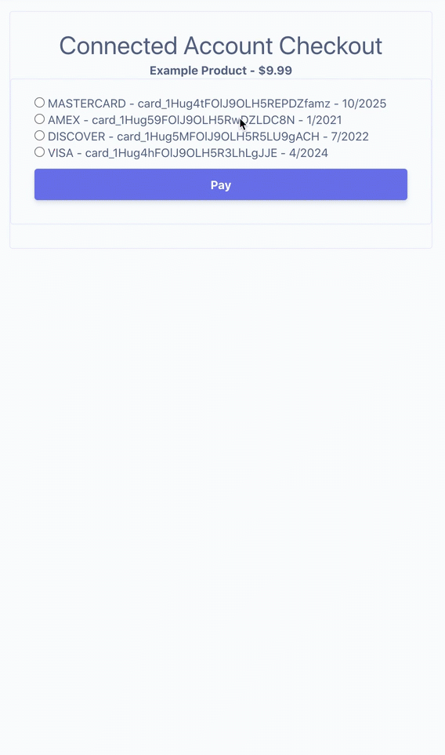

# Stripe Developer Office Hours - Clone payment method

> [🎬 Watch on YouTube](https://www.youtube.com/watch?v=ri07uPos1gs)

## Requirements
* Python
* [Stripe CLI](https://github.com/stripe/stripe-cli/)
* [Create a Stripe account](https://dashboard.stripe.com/register)
* [Create a Stripe Platform account](https://dashboard.stripe.com/register/connect)
* [Create a test Stripe Connected account associated with the platform account](https://stripe.com/docs/connect/standard-accounts#create-account)
* [API keys for your account](https://stripe.com/docs/keys)

## How to run
This project uses [Flask](https://flask.palletsprojects.com/en/1.1.x/) as its server. Here's how to run it after cloning.

1. [Create a Customer object](https://stripe.com/docs/payments/save-during-payment#web-create-a-customer) on the Stripe Platform account and [attach at least one payment method](https://stripe.com/docs/api/payment_methods/attach) using [dashboard](https://dashboard.stripe.com/customers) or [API](https://stripe.com/docs/api/customers/create).

2. [Create a Customer object](https://stripe.com/docs/payments/save-during-payment#web-create-a-customer) on the Connected account associated with the Stripe Platform.

3. Create and populate a `.env` file. There's a starter example you can copy in `server/`.

```
cp server/.env.example server/.env
# Then open server/.env in your text editor and paste in the API keys for your account and a Price ID.
```

4. Install dependencies and start up the server.

```
cd server/
virtualenv venv
source bin/venv/activate 
pip install -r requirements.txt 
python server.py
```

5. Go in your browser `http://localhost:4242` to see the demo



## More resources
* [The Flask Starter episode](https://www.youtube.com/watch?v=7Ul1vfmsDck)
* [Official Accept a payment guide](https://stripe.com/docs/payments/accept-a-payment)
* [Official clone customers across accounts guide](https://stripe.com/docs/connect/cloning-saved-payment-methods)
* [Official cloning payment methods guide](https://stripe.com/docs/payments/payment-methods/connect#cloning-payment-methods)
