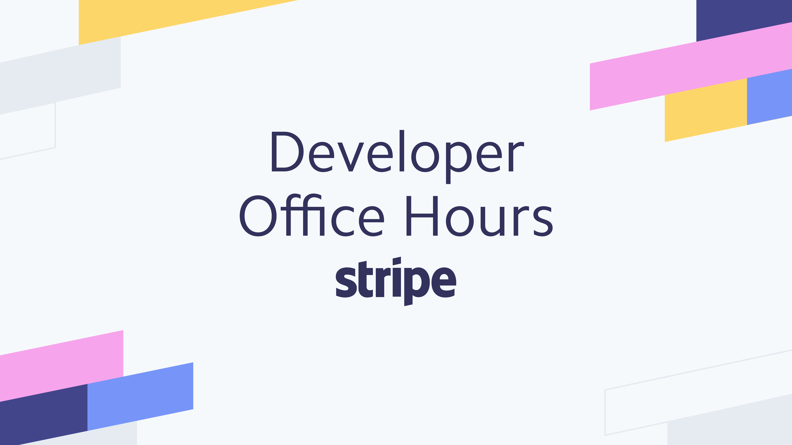

# Stripe Developer Office Hours
Stripe Engineers answering questions and walking through code examples on various topics.

## Upcoming office hours

Session | Hosts | Topic | Resources
---------|----------|---------|--------

> ℹ To receive notifications for future office hours, please subscribe to our [🎬YouTube playlist](https://www.youtube.com/playlist?list=PLy1nL-pvL2M6IYfRCmhOPcyC70zJqFoCs)

## Previous office hours

Session | Hosts | Topic | Resources
---------|----------|---------|--------
 [2019-08-14](./2019-08-14-auto-confirm) | [CJ Avilla](https://twitter.com/cjav_dev) and [Olivier Godement](https://www.linkedin.com/in/oliviergodement/) | [**One-Time Payments (SCA)**](./2019-08-14-auto-confirm) Live walkthrough of Payment Intents, one-time payments, and automatic confirmation workflows. | [🎦 YouTube](https://www.youtube.com/watch?v=ltv44zkpgo0&list=PLy1nL-pvL2M6IYfRCmhOPcyC70zJqFoCs)
 [2019-08-28](./2019-08-28-save-and-reuse-cards) | [CJ Avilla](https://twitter.com/cjav_dev) and [Sophie Wiepking-Brown](https://www.linkedin.com/in/sophiewb/) | [**Saving and Reusing Cards (SCA)**](./2019-08-28-save-and-reuse-cards)  Live walkthrough of Setup Intents, storing and reusing cards, and off-session confirmation workflows. | [🎦 YouTube](https://www.youtube.com/watch?v=95qSebQrm5E&list=PLy1nL-pvL2M6IYfRCmhOPcyC70zJqFoCs&index=3&t=0s)
 [2019-10-02](./2019-10-02-billing) | [CJ Avilla](https://twitter.com/cjav_dev) and [Zander Ebin](https://www.linkedin.com/in/zander-ebin-8212aab/) | [**Billing and Subscriptions (SCA)**](./2019-10-02-billing) Live demonstration of a Billing implementation for subscription-based payment flows. | [🎦 YouTube](https://www.youtube.com/watch?v=GOp-Pt82Bes&list=PLy1nL-pvL2M6IYfRCmhOPcyC70zJqFoCs)
 [2019-10-16](./2019-10-16-webhooks) | [CJ Avilla](https://twitter.com/cjav_dev) and [Adrienne Dreyfus](https://www.linkedin.com/in/adreyfus) | [**Webhooks**](./2019-10-16-webhooks) Live demonstration of implementing a webhook endpoint for Stripe events. | [🎦 YouTube](https://www.youtube.com/watch?v=oYSLhriIZaA&list=PLy1nL-pvL2M6IYfRCmhOPcyC70zJqFoCs&index=2&t=0s)
 [2019-10-30](./2019-10-30-connect-onboarding) | [CJ Avilla](https://twitter.com/cjav_dev) and [Hamish Kerr](https://www.linkedin.com/in/hamish-kerr-04270373/) | [**Connect Onboarding**](./2019-10-30-connect-onboarding) Live demonstration of implementing custom connect account onboarding. | [🎦 YouTube](https://www.youtube.com/watch?v=RYiscsdICrs&list=PLy1nL-pvL2M6IYfRCmhOPcyC70zJqFoCs&index=2&t=0s)
 [2019-11-21](./2019-11-21-checkout) | [CJ Avilla](https://twitter.com/cjav_dev) and [Sam Gerstenzang](https://www.linkedin.com/in/samgerstenzang/) | [**Checkout**](./2019-11-21-checkout) Live demonstration of using Stripe hosted Checkout to collect payment, store cards, and create recurring billing Subscriptions. | [🎦 YouTube](https://www.youtube.com/watch?v=VQ5jccnZ2Ow&list=PLy1nL-pvL2M6IYfRCmhOPcyC70zJqFoCs&index=2&t=0s)
 [2019-12-04](./2019-12-04-ios) | [Ali Riaz](https://www.linkedin.com/in/syedaliriaz/) | [**One-Time Payments with iOS**](./2019-12-04) Live demonstration of collecting one-time payments with iOS and the [stripe-ios client library](https://github.com/stripe/stripe-ios). | [🎦 YouTube](https://www.youtube.com/watch?v=s5Ml41bZidw&list=PLy1nL-pvL2M6IYfRCmhOPcyC70zJqFoCs&index=4&t=41s)
 [2019-12-24](./2019-12-24-issuing) | [CJ Avilla](https://twitter.com/cjav_dev) | [**Issuing Cards**](./2019-12-24-issuing) Live demonstration of issuing Credit Cards with [**Stripe Issuing**](https://stripe.com/issuing) | [🎦 YouTube](https://www.youtube.com/watch?v=knBWhYMqLds)
 [2020-01-28](./2020-01-28-variable-checkout) | [CJ Avilla](https://twitter.com/cjav_dev) | [**Variable Amount with Checkout**](./2020-01-28-variable-checkout) Live demonstration for taking donations where amount is defined by the donor. | [🎦 YouTube](https://www.youtube.com/watch?v=X2SmLzQ5kfY)
 [2020-02-13](./2020-02-13-ach) | [CJ Avilla](https://twitter.com/cjav_dev) | [**Setup Bank Account for ACH**](./2020-02-13-ach) Live demonstration for collecting and verifying Bank Account details for ACH. | [🎦 YouTube](https://www.youtube.com/watch?v=_1EX-DrikoA&list=PLy1nL-pvL2M6IYfRCmhOPcyC70zJqFoCs&index=3&t=0s)
 [2020-02-26](https://github.com/tmarek-stripe/demo-react-stripe-js) | [Thomas Marek](https://twitter.com/_ttmarek) | [**React Stripe.js**](https://github.com/tmarek-stripe/demo-react-stripe-js) Live demonstration for collecting one time payment details with React Stripe.js. | [🎦 YouTube](https://www.youtube.com/watch?v=w1oLdAPyuok&list=PLy1nL-pvL2M6IYfRCmhOPcyC70zJqFoCs&index=4&t=0s)
 [2020-04-01](./2020-04-01-klarna) | [Matthew Ling](https://www.linkedin.com/in/matthew-ling-53427711/) | [**Klarna One Time**](./2020-04-01-klarna) Live demonstration for collecting one time payments with Klarna. | [🎦 YouTube](https://www.youtube.com/watch?v=FXKYq0vw71k)
 [2020-04-02](./2020-04-02-pausing-subscriptions) | [CJ Avilla](https://twitter.com/cjav_dev) | [**Pausing Subscriptions**](./2020-04-02-pausing-subscriptions) Live demonstration of [Subscription pausing](https://stripe.com/docs/billing/subscriptions/pausing). | [🎦 YouTube](https://www.youtube.com/watch?v=177SsXpvy3I)
 [2020-04-08](./2020-04-08-batch-processing) | [Suz Hinton](https://www.linkedin.com/in/susanmhinton/) | [**Batch Processing**](./2020-04-08-batch-processing) Live demonstration of batch processing and dealing with API rate limits. | [🎦 YouTube](https://www.youtube.com/watch?v=gx1xxGv2Ljs&feature=youtu.be)
 [2020-04-13](./2020-04-13-coupons-and-subscriptions) | [Ali Riaz](https://www.linkedin.com/in/syedaliriaz/) | [**Subscriptions with Coupons**](./2020-04-13-coupons-and-subscriptions) Live demonstration of creating [Subscriptions with Coupons](https://stripe.com/docs/billing/subscriptions/discounts). | [🎦 YouTube](https://www.youtube.com/watch?v=NA19ikfx2qQ&feature=youtu.be)
 [2020-04-15](./2020-04-15-klarna-pay-installments) | [Matthew Ling](https://www.linkedin.com/in/matthew-ling-53427711/) | [**Klarna Installments**](./2020-04-15-klarna-pay-installments) Live demonstration of collecting payments in installments with [Klarna](https://stripe.com/docs/sources/klarna). | [🎦 YouTube](https://www.youtube.com/watch?v=tIEAs93ZW2Y)
 [2020-04-17](./2020-04-17-lumpy-subscription-payments) | [CJ Avilla](https://twitter.com/cjav_dev) | [**Lumpy Subscription Payments**](./2020-04-17-lumpy-subscription-payments) Live demonstration of using [Subscription Schedules](https://stripe.com/docs/billing/subscriptions/subscription-schedules) to create lumpy payments for subscriptions. | [🎦 YouTube](https://www.youtube.com/watch?v=2gws-r392I8&feature=youtu.be)
 [2020-04-23](./2020-04-23-disputes) | [CJ Avilla](https://twitter.com/cjav_dev) | [**Responding to Disputes**](./2020-04-23-disputes) Live demonstration of automating the [dispute](https://stripe.com/docs/disputes/responding) response process. | [🎦 YouTube](https://youtu.be/FrX8UerYmVg)
 [2020-05-01](./2020-05-01-refunds) | [Dawn Lambeth](https://twitter.com/dawnlambeth) | [**Refunds**](./2020-05-01-refunds) Live demonstration showing how to refund payments. | [🎦 YouTube](https://youtu.be/D6fd4coADsQ)
 [2020-06-29](./2020-06-29-customer-portal) | [Theodora Chu](https://twitter.com/chu_onthis) and [CJ Avilla](https://twitter.com/cjav_dev) | [**Customer Portal**](./2020-06-29-customer-portal) Live demonstration of integrating the [Customer Portal](https://stripe.com/docs/billing/subscriptions/integrating-customer-portal). | [🎦 YouTube](https://www.youtube.com/watch?v=u8H6awDJVpM)

## Changes

The Stripe API's and libraries are always being updated. It's possible that since recording, an API or library function has been deprecated. Please refer to this [changelog](https://stripe.com/blog/changelog) for updates.

## Additional Support
Find help and support for Stripe. Our support center provides answers on all types of situations, including account information, charges and refunds, and subscriptions information.

Get your questions answered and find international support for Stripe.

👉 [support.stripe.com](https://support.stripe.com)

### Technical questions on IRC
Have any technical questions? Our developers hang out in [#stripe on freenode](https://webchat.freenode.net/?channel=#stripe).
